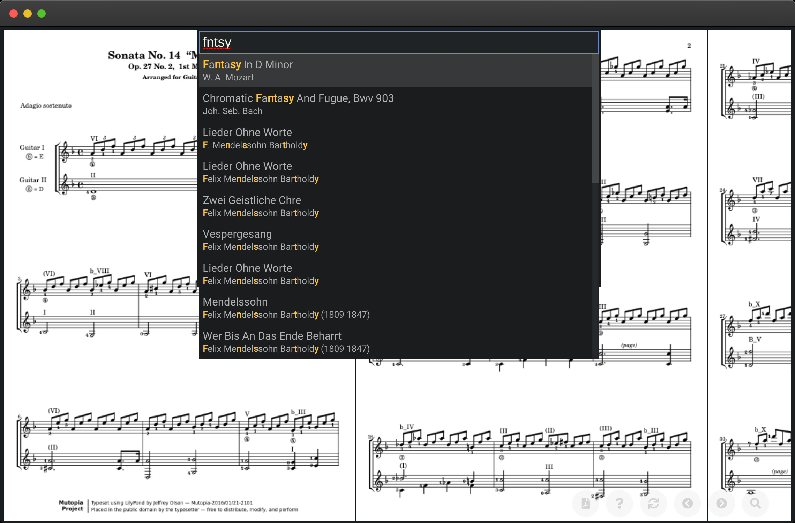

# Digital Music Stand

[](https://ci.patwie.com/PatWie/digitalmusicstand)

A simple cross-platform browser-based pdfjs-based viewer to display and search music sheets.



* Fast, single binary which includes all assets.
* Usage is similar to Sublime. Press `P` and perform a fuzzy search.
* Not database required
* Shortcuts `1,2` to scroll to previous/next page using a foot pedal.
* Unobtrusive design to download the file as a pdf

## DEMO

See [http://demo-digitalmusicstand.patwie.com/](http://demo-digitalmusicstand.patwie.com/) for a subset of the [Mutopia Project](https://www.mutopiaproject.org/) which are released under Creative Commons Attribution-ShareAlike.

## Get it

Download from the [release page](https://github.com/PatWie/digitalmusicstand/releases). The single binary contains all files.

## Or build it yourself

Or build it yourself:

```bash
git clone https://github.com/PatWie/digitalmusicstand.git
cd digitalmusicstand
./release.sh
```

## Usage

```bash
./digitalmusicstand --sheets /path/to/pdfs --port 3000
```

The files in the sheet directoy need to follow the convention `interpret_title.pdf`.
Whitespaces should be replaced by '-'.

Point your browser to `http://localhost:3000`

