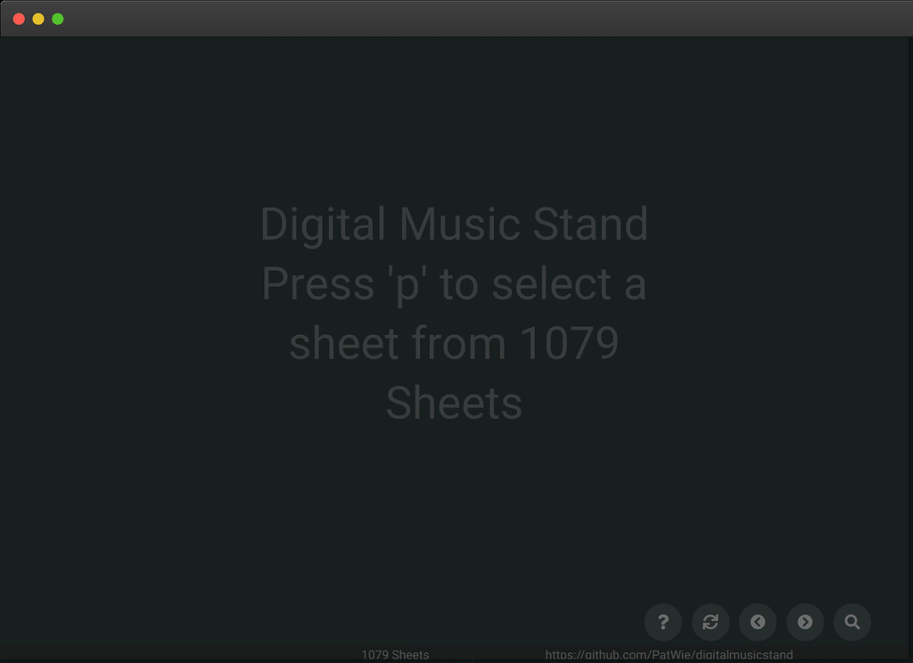

# Digital Music Stand

[](https://ci.patwie.com/PatWie/digitalmusicstand)

A simple cross-platform browser-based pdfjs-based viewer to display and search music sheets.



* A single binary including all assets.
* Usage is similar to SublimeText. Press `P` and perform a fuzzy search.
* Not database required
* Shortcuts `1,2` to scroll to previous/next page using a programmable foot pedal.
* Unobtrusive design
* Upload PDF when enabled
* Add sheets via simple file naming
* Use a YAML format to add whole songbooks and complex sheets

## DEMO

See [http://demo-digitalmusicstand.patwie.com/](http://demo-digitalmusicstand.patwie.com/) for a subset of the [Mutopia Project](https://www.mutopiaproject.org/) which are released under Creative Commons Attribution-ShareAlike.

#### Handling

Press `p` and then type `monlgiht3` (with typos).
You can use the arrow keys (up/down) to navigate. But for now select `Sonata No. 14 Moonlight (3rd Movement: Presto Agitato)` and press the `enter` key. To scroll to the next page use the right arrow key (or the key `2`).

#### Shortcuts

<dl>
  <dt>h</dt><dd> opens help dialog</dd>
  <dt>p</dt><dd> opens prompt for a query</dd>
  <dt>u</dt><dd> opens dialog to upload pdf (when enabled)</dd>
  <dt>enter</dt><dd> loads select sheet</dd>
  <dt>esc</dt><dd> closes all modal dialogs</dd>
  <dt>arrow key down</dt><dd> selects next entry in result list</dd>
  <dt>arrow key up</dt><dd> selects previous entry in result list</dd>
  <dt>arrow key right or key '2'</dt><dd> scrolls to next page</dd>
  <dt>arrow key left or key '1'</dt><dd> scrolls to previous page</dd>
</dl>

The short cuts `1` and `2` are for a programmable foot pedal

## Get it

Download from the [release page](https://github.com/PatWie/digitalmusicstand/releases). The single binary contains all files.

## Or build it yourself

Or build it yourself:

```bash
git clone https://github.com/PatWie/digitalmusicstand.git
cd digitalmusicstand
./release.sh
```

## Usage

```bash
./digitalmusicstand --sheets /path/to/pdfs --listen :3000
```

The files in the sheet directoy need to follow the convention `interpret_title.pdf`.
Whitespaces should be replaced by '-'.

Point your browser to `http://localhost:3000`

#### Add Songbooks

Alternatively, the YAML format can be used to add songbooks or complex sheets.

Example 1 (Songbook):
```yaml
# content of The_Big_Book_of_Jazz.yml
path: The_Big_Book_of_Jazz.pdf
artist: Various Artists
title: The Big Book of Jazz
songs:
    - artist: Artist 1
      title: Song 1
      pages: [2, 3]
    - artist: Artist 2
      title: Song 2
      pages: [4, 5, 6, 5, 6]
    - title: The Big Book of Jazz (Full book)
```

Example 2 (single sheet):
```yaml
# content of Let_it_be.yml
path: Let_it_be.pdf
artist: The Beatles
title: Let It Be
```
* Each song is added to the sheet list with its artist name and title. (see Example 1)
* The page numbers define the used pages of the PDF and their ordering. (see Song 1 and Song 2)
* If no page information for a song is provided, the complete pdf is used. (see Example 1)
* If no artist name for a song is provided, the artist name of the head is used. (useful for single artist songbooks)
* If no songs are provided, the head (artist anme and title) is used for a single sheet. (see Example 2)
* Subfolders are allowed in `path`.

To activate this functionality use the `--parse-yaml` flag:
```bash
./digitalmusicstand --parse-yaml --sheets /path/to/pdfs --listen :3000
```
